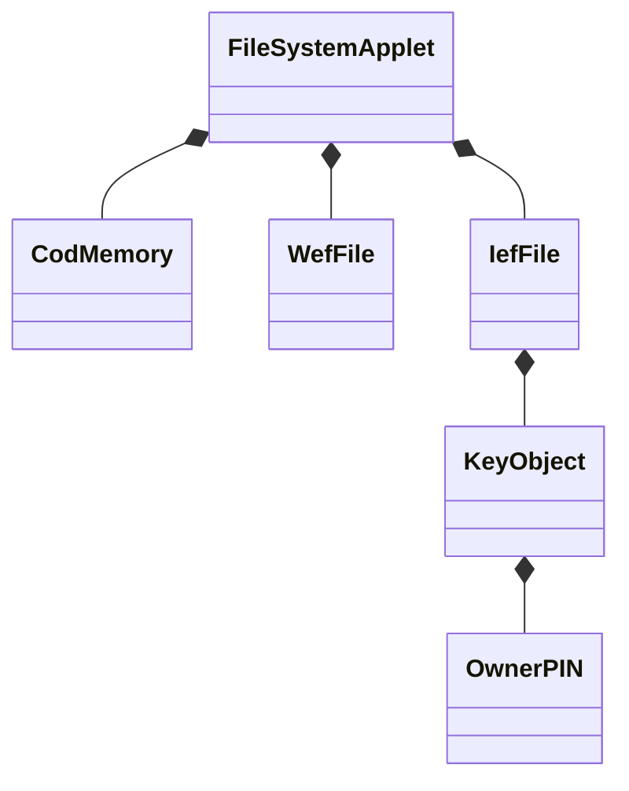

# COD・IEF・WEF・鍵オブジェクト

この章ではJPKI固有のAID、証明書、暗号鍵、コマンドはまだ扱いません。ICカードの基本設計を学ぶため、このプロジェクト内で用語と責務を次のように定義します。

## 用語の位置づけ

| 用語 | この教材での意味 | Java Card上の実装 |
| --- | --- | --- |
| COD | 一時的な作業データを置くtransientメモリ領域 | `CodMemory`が2種類のtransient配列を所有 |
| EF | データまたは内部情報を持つ論理的なElementary File | JavaクラスとしてApplet内に実装 |
| WEF | 通常データを格納するWorking EF | `WefFile`と永続`byte[]` |
| IEF | 鍵などを格納するInternal EF | `IefFile`が`KeyObject`を所有 |
| 鍵オブジェクト | PINや暗号鍵の利用規則を隠蔽するオブジェクト | `KeyObject`が`OwnerPIN`を所有 |

`CodMemory`、`WefFile`、`IefFile`はJava Card標準APIのクラスではありません。特にCODは、この教材で「transientメモリ」と定義した設計上の名前です。

## クラス構成



`FileSystemApplet`はAPDUを解釈し、各オブジェクトへ処理を委譲します。WEFは鍵の実装を知らず、IEFは通常データの読出し機能を持ちません。5クラスは別ファイルですが、1つのCAPにまとめるため同じJavaパッケージに置いています。

## サンプルのファイル

| FID | 種別 | 初期内容 | アクセス条件 |
| --- | --- | --- | --- |
| `1001` | WEF | ASCII `HELLO-WEF` | READは常時可、UPDATEはPIN照合後のみ |
| `1002` | IEF | 学習用PIN `1234`、最大3回 | VERIFYのみ。READ BINARYは禁止 |

ファイル選択状態は`CLEAR_ON_DESELECT`領域に置きます。別Appletを選択するとFIDは自動的に`0000`へ戻り、再選択後はもう一度EFを選ぶ必要があります。

## APDU一覧

| 操作 | APDU | 結果 |
| --- | --- | --- |
| WEF選択 | `00 A4 02 0C 02 10 01` | FID `1001`をCODへ記録 |
| IEF選択 | `00 A4 02 0C 02 10 02` | FID `1002`をCODへ記録 |
| WEF読出し | `00 B0 00 00 09` | `HELLO-WEF 9000` |
| PIN照合 | `00 20 00 80 04 31 32 33 34` | 正しければ`9000` |
| WEF更新 | `00 D6 00 00 02 4F 4B` | 先頭2バイトを`OK`へ更新 |
| COD状態取得 | `80 30 00 00 03` | 選択FID 2バイト＋カウンター1バイト |
| CODカウンター加算 | `80 31 00 00` | `CLEAR_ON_RESET`領域を加算 |

WEF更新は次の順に行います。

1. IEF `1002`をSELECT
2. VERIFYでPIN `1234`を照合
3. WEF `1001`をSELECT
4. UPDATE BINARYで永続データを更新
5. READ BINARYで結果を確認

PINが誤っている場合は`63Cx`を返し、`x`が残り試行回数です。未照合のUPDATEは`6982`、EF未選択のREADは`6985`、IEFに対するREADは`6986`、存在しないFIDは`6A82`を返します。

## メモリとオブジェクトの寿命

| 対象 | 作成方法 | 選択解除 | リセット／電源断 |
| --- | --- | --- | --- |
| `CodMemory`本体 | `new CodMemory()` | 残る | 残る |
| 選択FID | `CLEAR_ON_DESELECT`配列 | 0クリア | 0クリア |
| 作業領域・カウンター | `CLEAR_ON_RESET`配列 | 残る | 0クリア |
| `WefFile`と内部配列 | 通常の`new` | 残る | 残る |
| `IefFile`、`KeyObject`、PIN値・試行回数 | 通常の`new`／`OwnerPIN` | 残る | 残る |
| PIN照合済み状態 | `OwnerPIN`内部状態 | `deselect()`で解除 | 解除 |
| `process()`のローカル変数 | メソッド呼出し時 | 呼出し終了時に寿命終了 | ― |

重要なのは、`CodMemory`インスタンス自体がtransientになるわけではない点です。Java Card Classicでは、`JCSystem.makeTransientByteArray()`で作った配列の内容が指定イベントでクリアされます。永続オブジェクトである`CodMemory`は、そのtransient配列への参照を保持します。

WEFの永続データ更新には電源断時の原子性が必要です。この教材の`WefFile.update()`は`Util.arrayCopy()`を使います。複数の永続フィールドを一貫して変更する場合は、`JCSystem.beginTransaction()`と`commitTransaction()`も検討します。

## テストとステップ実行

全14テストを実行します。

```powershell
.\scripts\test.ps1
```

VS Codeで**Java Card: COD・EFをステップ実行**を選び、次の箇所にブレークポイントを置きます。

- `FileSystemApplet.process()`：APDUの入口
- `CodMemory.selectFile()`：transientな選択状態
- `KeyObject.check()`：PIN照合
- `WefFile.update()`：永続データ更新
- `FileSystemAppletTest.codDeselectAndResetAreasHaveDifferentLifetimes()`：寿命テスト全体

テストでは、WEF読出し、アクセス拒否、PIN残回数、認証後更新、選択解除、リセット、永続データ保持を確認します。

## 実装上の注意

- `process()`のたびにオブジェクトを`new`せず、インストール時に確保します。
- IEF内のPINをREAD BINARYで外部へ返しません。鍵は値ではなく操作として公開します。
- PIN `1234`は学習専用です。実運用では個別のパーソナライズ手順が必要です。
- 実カードがOSレベルで提供するMF／DF／EFと、このApplet内の論理EFは別物です。
- jCardSimの結果だけで実カードのメモリ・電源断耐性を保証することはできません。

## 参考資料

- [Oracle JCSystem API](https://docs.oracle.com/en/java/javacard/3.1/jc_api_srvc/api_classic/javacard/framework/JCSystem.html)
- [Oracle OwnerPIN API](https://docs.oracle.com/en/java/javacard/3.1/jc_api_srvc/api_classic/javacard/framework/OwnerPIN.html)
- [JBMIA「ICカード ファイル設計の手引き」](https://www.jbmia.or.jp/~card/base/contents/uploads/sekkei_tebiki.pdf)
